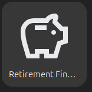
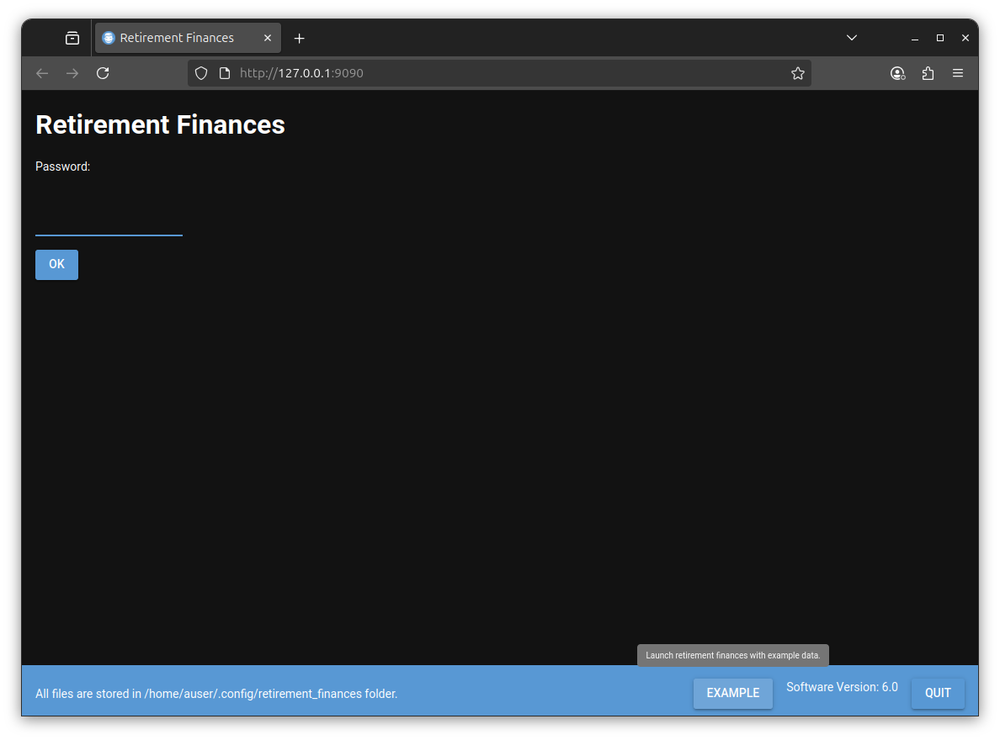
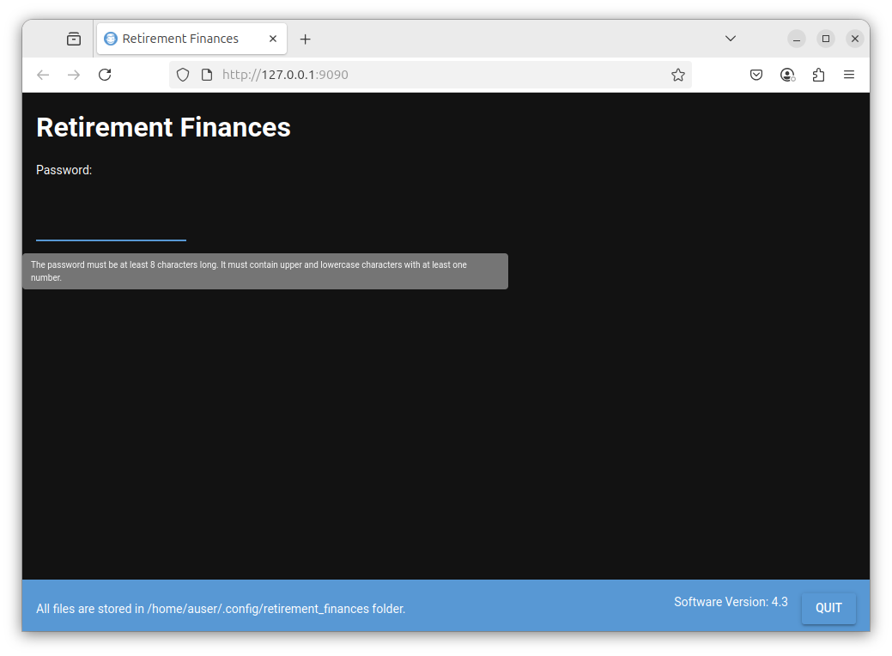
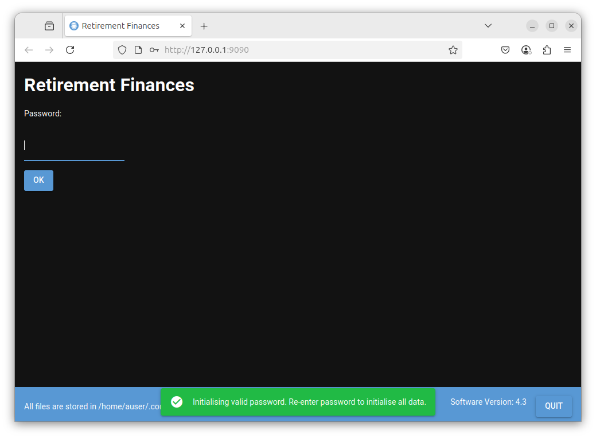
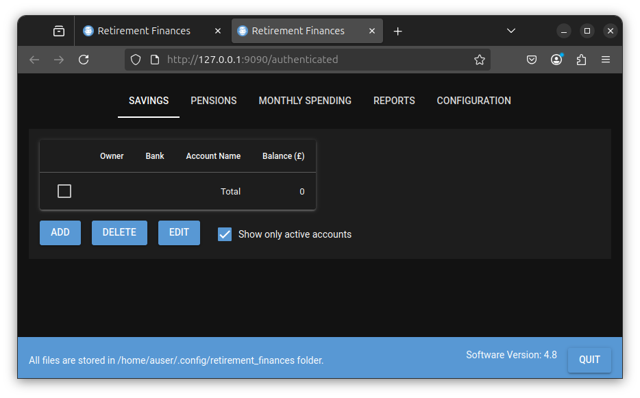
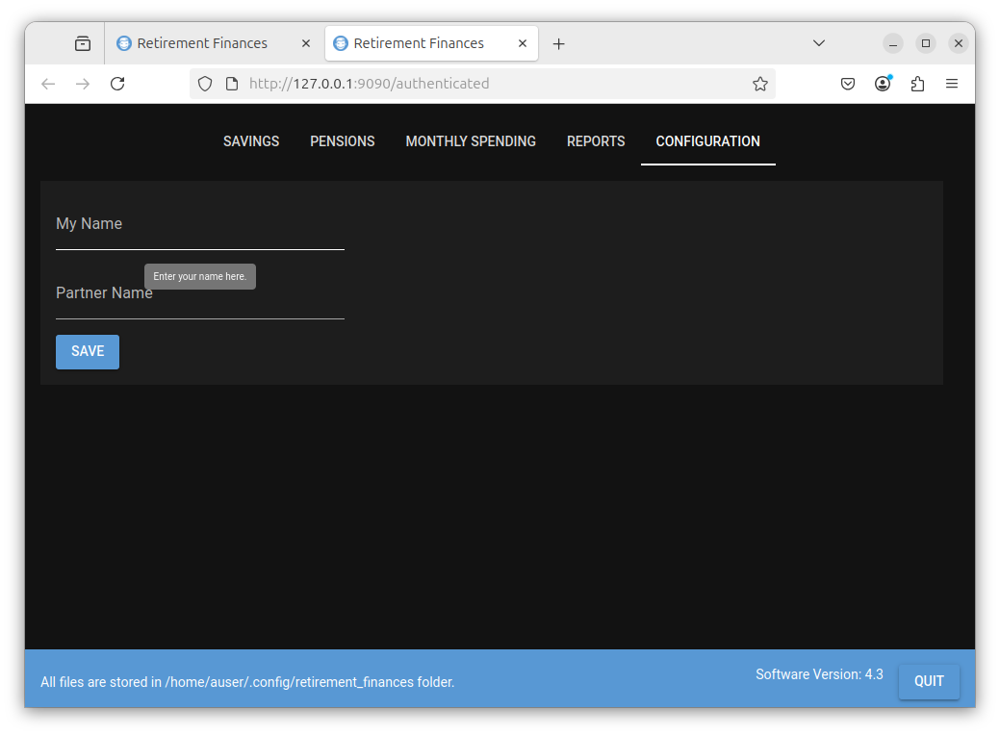
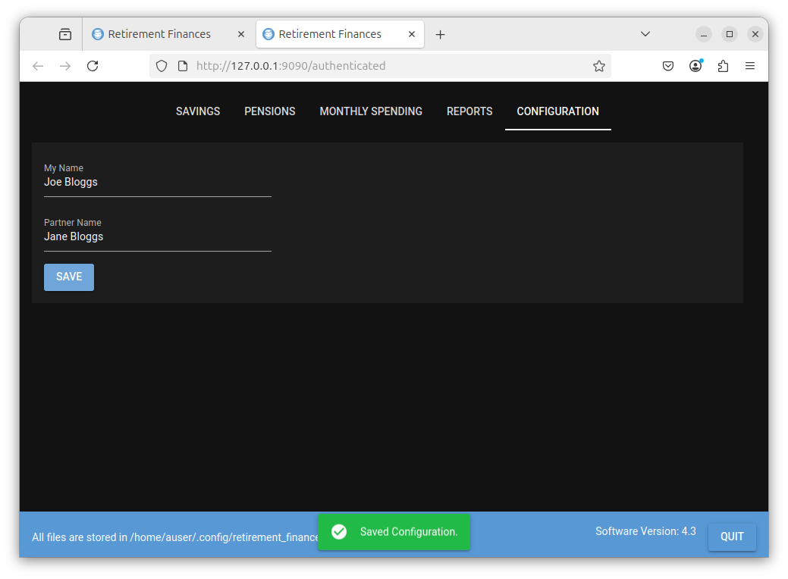

# Retirement finances
I designed this tool to give me some idea if I had enough money to retire and also to allow me
to plan monthly and one off expenditure so that I can try and predict the effect of spending
decisions into the future. I choose the above approach as it allows me to adjust my spending
as time progresses.

I used spreadsheets to do some projections and these were useful but it appeared
it would be easier and more flexible to have the functionality included in a
software package. As I have worked as a software engineer for some time I thought
I would give this a go.

I wanted a tool that I could use to project various scenario's based on what I considered
possible parameters (E.G pension growth rates, savings interest rates etc). Professionals with
much more knowledge of such predictions/guesses than I, appear not to be able to make
very accurate predictions (particularly over longer timescales).

Therefore I (who have no background in finance) wanted a tool to track the progression of
my finances over time so that I can adjust my spending as early as possible if required.

This tool must be used with care, the retirement choices you make are yours alone. You may wish to
consult a financial advisor to understand your options so that you make the best decisions
with regard to your retirement as mistakes can be very costly. Also the UK money and pensions
service (https://maps.org.uk/en) has useful information when considering retirement.

It is unclear to me if this tool will be useful to others given it was designed for my requirements.

It is offered as is under the MIT license, you can make the judgment on whether it may be useful to you.


# Assumptions this tool makes
The assumptions made by this tool are shown below. These assumptions define the constraints I chose when designing this tool. They may not be directly applicable to your situation.

- The tool is aimed at retirement in the UK.

- Savings interest accrues daily but is added at the start of each year for the previous year.

- Pensions funds accrue (rise/fall) daily and are added daily.

- State pension changes (hopefully increases) in April for the new financial year. The first
  full month of the changed state pension will be in May.

- This tool does not take tax into account.

- Money is taken from either savings or pensions to meet outgoings during retirement.

- This tool deals with draw down pensions only.

- If you die before age 75 then your personal pension will be available
  to your partner (if you have one) as a tax free lump sum.


# Installing the software
The 'Retirement Finances' software (the App) can be installed on Linux and Windows platforms.

# Installing on Linux

Click [here](installers/linux/README.md#linux_installer) for details of how to install the software on Linux platforms.


# Installing on Windows

Click [here](installers/windows/README.md#windows_installer) for details of how to install the software on Windows platforms.

# Installing on macOS

Click [here](installers/macos/README.md#macos_installer) for details of how to install the software onto macOS platforms.

# Using the software

## Overview
The software stores details of your savings and pension accounts. This information is only stored locally on your PC and all the files in which this information is stored are encrypted.

A general overview of the Apps functionality is listed below.

- Enter your savings details.
- Enter your pension details.
- Enter details of your spending as time progresses.
- Make predictions of how long these will last.
- Check your expenditure as time progresses to see how you are doing against the above predictions.

As stated previously the predictions are based on your guesses regarding future growth of pension
funds, interest rates and spending.


# Starting the software

## On Linux
- Open a terminal window and enter

```
retirement_finances
```

Shortly afterwards (the time will depend how fast your PC is) a 'Retirement Finances' browser window should open asking you to enter a password as shown below under 'Initial browser window'. Command line help text is displayed if you use the -h argument.

### Creating a gnome startup icon

- To create a gnome app startup icon enter

```
retirement_finances -a
INFO:  Created gnome desktop application launcher
```

The startup icon has now been created. To access the gnome launcher icon on Ubuntu, press the Windows key on your keyboard and enter 'retire'. You should see the icon displayed below. Selecting this icon should startup the retirement_finances program.




## On Windows
Type 'Retirement_Finances' after selecting the Windows Start button and select 'Retirement_Finances' under 'best match'. This opens a window indicating that the application is starting up. Shortly afterwards (the time will depend how fast your PC is) a 'Retirement Finances' browser window should open asking you to enter a password as shown below under 'Initial browser window'.


## On macOS
- If your default browser is Safari then you should change the Safari settings to allow popup windows from local applications.

  - With Safari running go to Safari > Settings > Websites > Pop-up Windows

  - Look for 127.0.0.1 or localhost. Note that this may not be present until retirement finances is launched for the first time.

  - Set it to "Allow"

If your default web browser is google chrome or Firefox then no changes are required to the default configuration.

- Open a Terminal window (Launcher / Other / Terminal)
- Enter the following command

```
retirement_finances
```

Command line help text is displayed if you use the -h argument.


# Initial browser window

This will open your systems default web browser as shown below



## Blue bar at the bottom of the browser window.

- Quit button

This must be selected to shut down the program. If you just close the browser window the Retirement Finances (App) will stay running. You can reconnect to it by entering 127.0.0.1:9090 into the browsers address bar. The app will only be accessible from your local machine.

- Software Version

To the left of the Quit button the Retirement Finances App software version is displayed.

- Storage Folder

On the left hand side of the blue bar the folder where all the files created by the App are stored is detailed. All these files are encrypted. The password prompted for is used to decrypt the data in these files. If you ever wish to delete all data used by the App and start again then you should shut down the App (click the Quit button) and then manually delete this folder.

## Entering a password.

As detailed above all the files created by the App are encrypted and you must enter a password to encrypt and decrypt the data in these files.

The first time you open the App no password will have been set.

To create a password enter the password that you wish to set in the Password field and select the OK button. If you select the Password field with your mouse then a tooltip is displayed indicating what to enter into the field as shown below. When using the App all fields should have tooltips associated with them to indicated the expected input.




Enter a password that you wish to use. The following message will then be displayed



Enter your password again and the following is displayed




# Note !!!

If you forget this password you will no longer be able to access the App data.

The App has now been started and you have logged in. You may now move onto the section below.


# Initial Configuration

The window displayed has the following tabs

- SAVINGS

Details your savings accounts.

- PENSIONS

Details your pensions (Personal and State).

- MONTHLY SPENDING

You may add details of the total amount you spend each month here. This is used to track your actual spending against your predicted spending.

- REPORTS

This is where you can generate reports including predictive plots of your current and future finances.

- CONFIGURATION

The global configuration for the App is stored here.

At this point you should select the CONFIGURATION tab.

Initially this will be as shown below



You must enter your name here. You may optionally enter your partners name.

For the purposes of this tutorial 'Joe Bloggs' and 'Jane Bloggs' will be entered.

Enter the name/s as required and select the OK button to save them, as shown below.




## Steps Required To Enter Your Current Financial State

Once the initial configuration (as detailed above) is complete the following steps should be performed.

- Setup savings accounts as details [here](setup_savings_accounts.md#setup_savings_accounts)

- Setup pensions information as detailed [here](./setup_pension_details.md#setup_pension_details)


## Enter Monthly Spending

The 'MONTHLY SPENDING' tab allows you to enter the total amount you spend each month as time goes by.
This is not your predicted monthly spending but the actual amount your spend each month. Over time this data builds up
and is used to plot your actual spending each month and your average spending each month and can be
displayed against your predicted spending each month. This is useful to show you how much a
'grasp' you have on your outgoings.

This monthly spending table should be updated regularly (E.G monthly).

- For details of how to use the 'Enter Monthly Spending tab click [here](./monthly_spending.md#monthly_spending)

## REPORTS

This is where you can see the total state of your finances and try out different predictions
including predictive plots.

- For details of how to use the reports functionality click [here](./reports.md#reports_start)