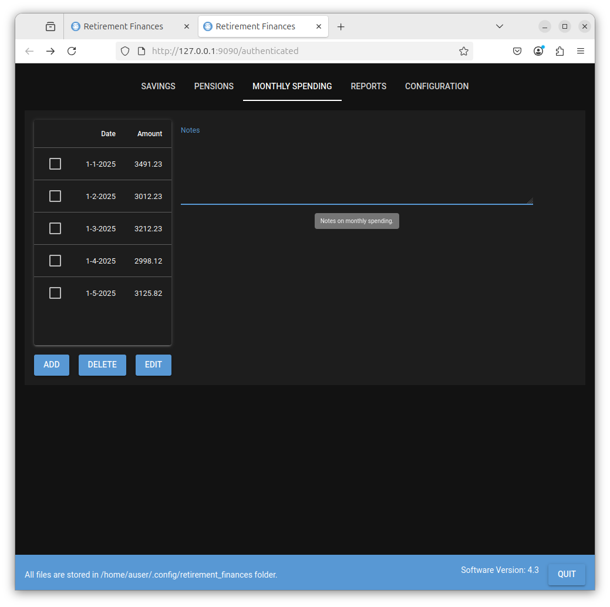

# MONTHLY SPENDING {#monthly_spending}
This table allows you to record the total amount you spend each month as time progresses. When predicting how long your savings and pensions will last, this is used to plot against the predicted monthly spending.

The table details the date and the amount spent. Select the ADD button to add the date set to the 1'st of the month. The amount entered should be the total amount you spent in that month.

The Notes field is a field to allow you to enter any information you wish, about your monthly spending.

# Example Data

For purposes of this tutorial I added the following monthly spending values.

