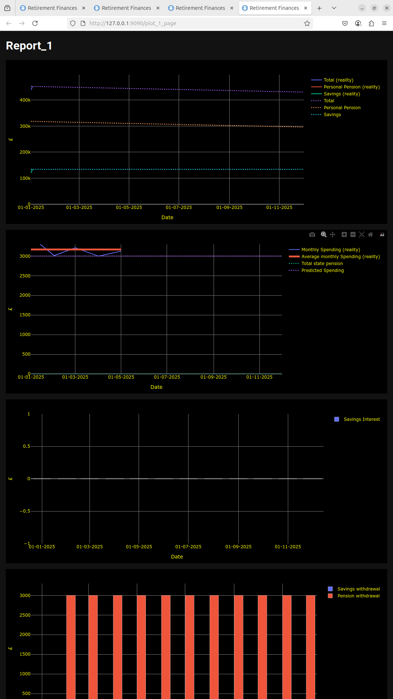
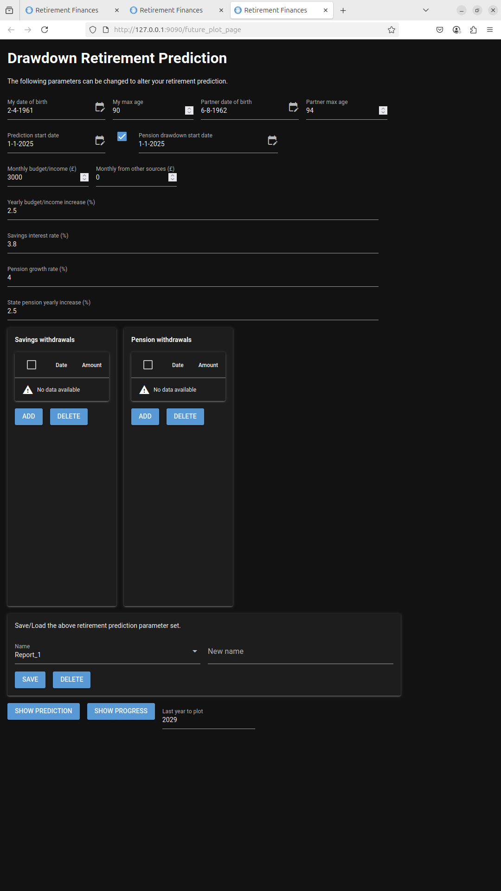
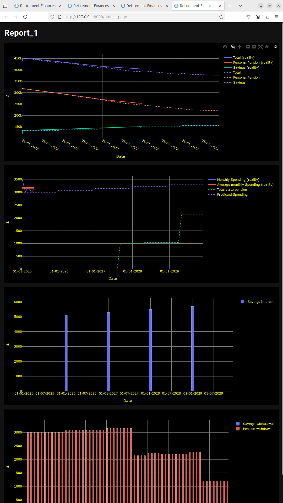
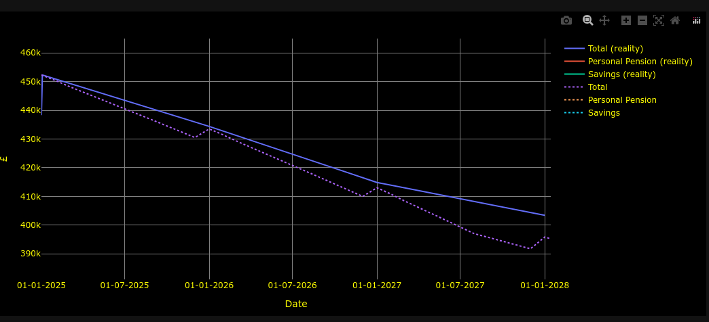

# COMPARING PREDICTIONS WITH REALITY {#reality_report}

## Checking your monthly spending

To plot your monthly spending you should regularly update the MONTHLY SPENDING table with details of your monthly spending.

The monthly spending example data shown previously is used. The Drawdown Retirement Prediction form was completed as shown below.
Note that the Last Year to plot field was set to 2025 so that only one year is plotted.

The SHOW PROGRESS button was then selected and the following plot is produced.

The second plot now shows the 'Monthly Spending (Reality)' and 'Average monthly spending (reality) traces. The predicted spending is shown on this plot. No state pension is shown because no state pension is being received in this year.

This shows data over a few months. It should become more useful as time progresses and more real data is available.

### Note
Any of the traces can be hidden if required by clicking on the legend name on the right hand side of the plot area.

# Checking your pensions and savings performance.

In order to compare the predictions with reality you must, over time, enter data into the App that details how each Savings account and pension changes. At any time you can update the value in a savings or pension tables and this is then used to show how the real values in your savings and pensions change.

For purposes of this example the Savings and Pensions were updated so that they both grew by ~ 4% a year for 3 years from 2025. Three separate values (one for each year) were entered for each of the Savings and pensions accounts. The Drawdown Prediction Retirement form was then updated as shown below. Note the Last year to plot is set to 2029.

The SHOW PROGRESS button was selected and the following plot was generated.

The plot now shows the real value traces as non dashed lines and the predicted values as dashed lines. You can zoom into section of the plot of by dragging a rectangle over the area you wish to view. An example of this is shown below.

