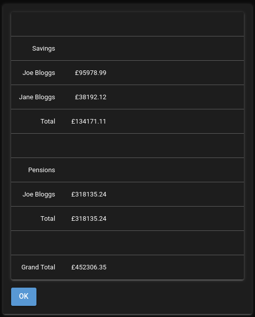

## REPORTS
This contains two buttons as detailed below.

### TOTALS
Simply gives the current total of all the latest entries in all the SAVINGS and PENSIONS amounts tables.

The following shows the totals of the all the entered example savings and pensions.

### DRAWDOWN RETIREMENT PREDICTION.

This is where predictions can be made based on your guesses about how long you and your partner (if you have one) will live, future savings and pensions performance, etc.

There are a number of parameters on this form. The default/initial state of this form is shown below.

Each of these parameters is detailed below.

- My Date of Birth

  Enter your date of birth here.

- My max age

  This is the maximum age that you wish to plan for.

- Partner date of birth

  If you have included your partner in your finances then add their date of birth here.

- Partner max age

  This is the maximum age that you wish to plan for.

- Prediction state date

  The date you wish the prediction to start. This would typically be the date at which you wish to retire.

- Pension draw down start date

  The checkbox to the left of this field must be selected to allow you to enter this date. When entered the date defines the point at which you start regularly drawing down from your pension to fund your retirement. Before this date your savings are used to fund your retirement.

- Monthly budget/income

  This is the amount you expect to spend each month (on average) to live the life you wish to live during retirement.

- Monthly from other sources

  This is a fixed amount that you expect to receive each month from any source. This amount is deducted from the 'Monthly budget/income' to determine how much you need to take from savings or pensions each month.

- Yearly budget/income increase (%)

This is a list (comma separated. This first value being the prediction start year. The second being the next year and so on) of yearly percentage increases in your 'Monthly budget/income' in order to allow you to keep pace with inflation. Each comma separated value is applied to each year from your Prediction start date. Enter your guesses here.

- Savings Interest rate (%)

This is a list (comma separated. This first value being the prediction start year. The second being the next year and so on) of yearly savings rates to be applied to all your savings. Each comma separated value is applied to each year from your prediction start date. Enter your guesses here.

- Pension growth rate (%)

This is a list (comma separated. This first value being the prediction start year. The second being the next year and so on) of yearly pension growth rates rates to be applied to all your pensions. Each comma separated value is applied to each year from your prediction start date. Enter your guesses here.

- State pension yearly increase (%)

This is a list (comma separated. This first value being the prediction start year. The second being the next year and so on) of yearly state pension increases to be applied to all state pensions (max of two, you and your partner). Each comma separated value is applied to each year from your prediction start date. Enter your guesses here.

Also displayed are the 'Savings Withdrawals' and 'Pension Withdrawals' tables. These allow you to enter dates and amounts to deduct from savings or pensions on an ad hoc basis (E.G holidays, buy an expensive item etc). You may select the ADD button to add one or more deductions from either savings or pensions.

Note that you do not need to add pension withdrawals after the Pension drawdown date field (if you selected it and entered a value) as these will be calculated to withdraw sufficient funds to reach your monthly budget/income. The Pension withdrawals table allows you to add drawdowns on your pension on an add hoc basis before you decide to start a regular drawdown on your pension funds.

Near the bottom of the page a highlighted section allows you to save all the above parameters as a group. You may want to enter best case and worst case scenarios to allow you to try out the effect of changing different values of, for example, savings interest rates or pension growth rates. A Default option is present and you may enter a name into the 'New name' field and then select the save button to add to the pull down list. When a Name is selected from the pull down list it will populate the form with the values associated with the name you gave. If you select the DELETE button you may delete the name from the pull down list.

At the bottom of the following buttons exist.

#### SHOW PREDICTION BUTTON

This will create a new page that displays plots. Four separate plots are displayed as detailed below.

Plot 1 -

A prediction of your savings and pensions value over time until the maximum of either you or your partners age. The total plot is the sum of the savings and pension values.

Plot 2 -

Your predicted Monthly budget/income, predicted total state pension (if you included yor partner this is the sum of both your state pensions) and your predicted spending.

Plot 3 -

Your predicted savings interest over time.

Plot 4 -

Your predicted savings withdrawals and your predicted pension withdrawals.

#### SHOW PROGRESS BUTTON

This shows the same plots as when the SHOW PREDICTION button is selected and also plots the actual value of savings and pensions. These values come from the amounts entered over time into the savings and pensions tables. You can then compare the predicted savings and pensions values over time with the actual values.

The actual amount spent each month is also plotted (along with the average) this allows you to see how accurate your spending estimates/guesses were.

The actual value can only be plotted as time progresses and you update these tables with savings values, pension fund values and amount spent.

### Last year to plot
By default the plots continue up to the year (in your report) that neither of you remain alive. You can truncate this to view a shorter period of time by entering a year before the max year. This can be useful to view how your plan is progressing.

The plots allow you to zoom in on points of interest at any time but this field allows the plots to be truncated if required.

# Report On Example Data

We can now generate some reports on the savings and pension example data. The Drawdown Retirement Prediction for was completed as shown below.

The SHOW PREDICTION button was then selected and the following plot was generated.

Note that each plot has a toolbar (move mouse to the top right of the plot area to shw it) that is as shown below. The default zoom tool is selected to allow you to drag a rectangle
over the plot area to zoom in.

Based on the parameters entered into the Drawdown Retirement Prediction form the red warning indicates message indicates that the money ran out during the plan.

The first plot shows how your savings and pension dropped over time.

Savings were initially used to pay your monthly income/budget and automatically switched to using pensions when the savings ran out.

If the 'Pension drawdown start date' is changed to be the same as the report start date (1-1-2025) then pensions would be used from the start. This was changed and the SHOW PREDICTION button was then selected again.

The first plot now shows the pensions dropping first. Savings increases until savings have to be used to pay the monthly budget/income. However the result is the same, the money runs out.

This shows how you can play with all the parameters available on the form and how it can change the prediction.

For the next plot the Monthly budget/income value is changed to £3000 from £3500 and the SHOW PREDICTION button was then selected again as shown below.

This time the money did not run out (!!! only just). Adjusting the other parameters on the form will also have effects on the outcome.

The second row plot shows the income from state pensions. On it you can see when yours and you partners cuts in. As state pension is received it reduces the amount that the app needs to pension and or savings to meet the monthly budget/income.

The third row on the plot shows the predicted amount received from interest on savings. This is based on the interest rate/s that you entered on the Drawdown Retirement Prediction form.

The final row shows how money is used from either pensions or savings to meet your monthly budget/income. The increase on the right hand side is because the App assumes that when one of you dies their state pension will stop. Therefore money to meet your monthly budget/income has to come from other sources.

Click [here](./reality_report.md) if you wish to see how to compare the predictions with reality.
