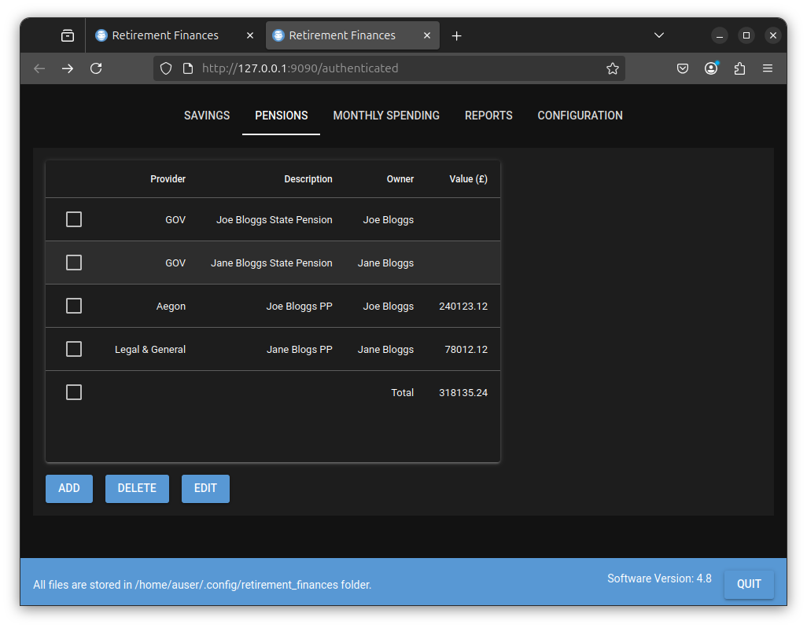

# PENSIONS Tab {#setup_pension_details}
This is similar to the SAVINGS tab but allows you to add all your pensions (State and Personal). The list of pensions will initially be empty. Select the ADD button to add details of a pension to the list.

Before any pensions are added this should appear as shown below.

The ADD, DELETE and EDIT buttons allow add, delete and edit the pension list.

Select the Add button and the following is displayed in a similar fashion to the SAVINGS tab.

This contains the following fields.

- State Pension

  If checked then you must enter details of your expected state pension. If deselected then the page should hold details of a non state pension (E.G personal pension) that you hold.

- Provider

  If the state pension field is selected then this field is fixed as GOV. If the state pension field is deselected then you may enter details of your pension provider in this field. This is not a required field.

- Description

  This allows you to enter a description of the pension. This is a required field.

- State Pension State Date

  If the state pension field is selected then you should enter the date at which your state pension is expected to start. If the state pension field is deselected then this field is greyed out. This is a required field for a state pension.

- Owner

  You may select the owner of this account from the drop down list. This should be either you or your partner.

- Date/Amount table

If the state pension field is selected then you should enter your current state pension amount. This is the value that the HMRC say will be your yearly pension if you received it now. You can update this each year as the state pension changes.

If the state pension field is deselected then this should be the current value of your pension fund. You should update this from time to time to detail the value of your pension fund.

# Example Data

For purposes of this tutorial I added the following pensions.

When the BACK button is selected these four pensions are displayed as shown below.

