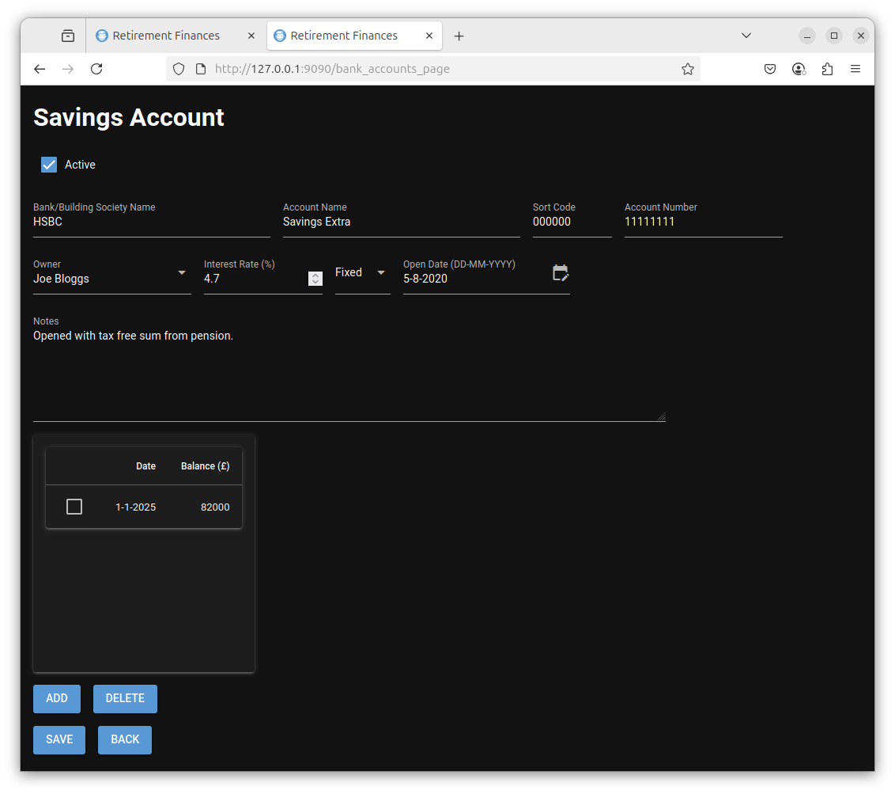

# SAVINGS Tab {#setup_savings_accounts}

The savings tab displays a list of your savings accounts.

The initial state with no savings accounts defined is shown below.

The ADD, DELETE and EDIT buttons allow add, delete and edit the savings accounts in this list.

# Add A Savings Account

Select the Add button  and the following is displayed

If you hover the mouse over each field a tooltip will be displayed indicating the expected input.

These are

- Active

  This should be selected if this account should be included in your retirement planning finances.
  Typically this would be checked initially but can be unchecked if the account is no longer used
  or contains money that you don't wish to be included in funding your retirement.

- Bank/Building Society Name

  The name of the organisation where the savings are held. This is a required field (I.E you must enter something). Initially, when getting used to how this program can be used you may wish to enter dummy data.

- Account Name

  This field details the name of the account. This is also a required field.

- Sort code

  This is not a required field and may be left blank.

- Account Number

  This is not a required field and may be left blank.

- Owner

  You may select the owner of this account from the drop down list. This is either you, your partner or Joint.

- Interest rate

  The expected interest rate when the account was opened. This is not a required field and may be left at 0%. This value is not used in any calculations and is just for your reference.

- Fixed/Variable

  This is a dropdown list and indicates whether the interest is fixed rate or variable rate. This is not a required field and may be left at fixed. his value is not used in any calculations and is just for your reference.

- Open Date

  This should be the date when the account was opened. This is a required field. The date format is DD-MM-YYYY.

- Notes

This is a free form text field that allows you to enter any information you wish about the savings account. This is optional and can be left blank.

- Date/Balance Table.

  Initially this will be empty. Select the ADD button and enter a date and balance and then select the OK button to add a balance to the savings account. Values in this table are used as part of your total savings when making predictions.

Once you have finished filling in this form select the SAVE button to save the savings account details. The BACK button will take you to the previous window.

# Example Data

For purposes of this tutorial I added the following savings accounts.

When the BACK button is selected these three  accounts are displayed as shown below.

